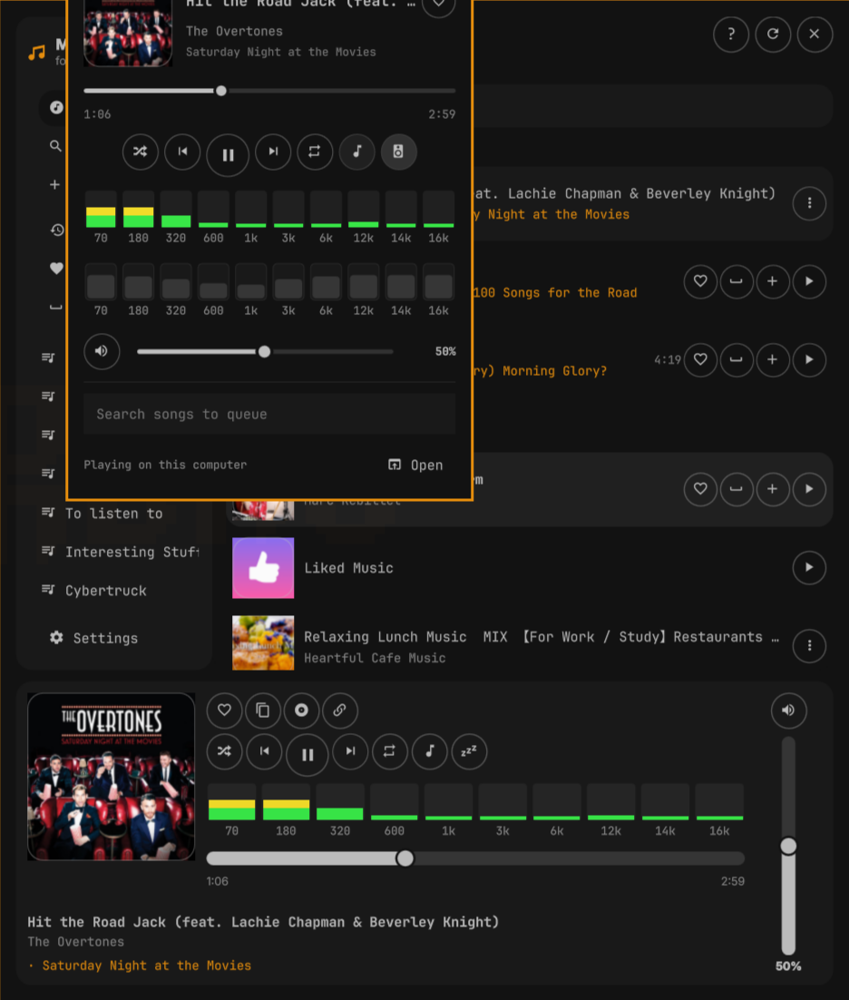

# OMA Music



Native [Omarchy](https://omarchy.org) player for **YouTube Music**. Plugin id
`wizwam.omamusic`.

Search, library, playlists, a mini player, and a full window live in the
Omarchy shell. Audio is local **mpv** + **yt-dlp** — no Chromium tab, no
official desktop API, and not an MPRIS chip for a browser session.

This is a Wizwam fork of
[rlimberger/omarchy-ytmusic](https://github.com/rlimberger/omarchy-ytmusic)
by [rlimberger](https://github.com/rlimberger). Layout from
[stappmus/Omarchy-Spotify](https://github.com/stappmus/Omarchy-Spotify);
EQ, spectrum, and the bar pill from [bjarneo/cliamp](https://github.com/bjarneo/cliamp).

- Live ten-band spectrum (cliamp-style green / yellow / red)
- Matching 10-band EQ with presets, remembered across restarts
- **Super+Shift+M** toggles the full player (instead of Spotify)
- Bar chip on the right, before the tray, with the current title

Requires `mpv` and `yt-dlp`. Setup downloads a prebuilt `omamusic`
daemon (no `cargo`). It builds from source if that download fails and
`cargo` is present, and falls back to Python only if both are unavailable.

## Install

```bash
omarchy pkg add mpv yt-dlp
omarchy plugin add https://github.com/lukejmorrison/omamusic.git --enable
```

From a checkout:

```bash
./scripts/install-local.sh --section right
```

The first play starts an on-demand user unit. It is **never enabled at
login**. `scripts/setup.sh` installs the Rust daemon (`omamusic`) from
the pinned GitHub Release.

## Sign in

1. Sign in at [music.youtube.com](https://music.youtube.com) in daily Chromium.
2. Super+Shift+M, or click the bar icon.
3. **Set up and continue** → **Use Chromium session**.

Search and home work without login. Library, likes, and playlists need that
session. Cookies land in `~/.config/omarchy-ytmusic/browser.json` (mode 600),
or `~/.config/omamusic/browser.json` when the Rust daemon is in use.

## Controls

| Input | Action |
| --- | --- |
| Super+Shift+M | Toggle the full player (was: Spotify) |
| Super+Shift+Alt+M | Unchanged: Music TUI (`cliamp`) |
| Left-click bar chip | Mini player |
| Middle-click bar chip | Previous track |
| Right-click bar chip | Next track |

```bash
omarchy shell -q wizwam.omamusic.player togglePlayer
omarchy-ytmusic --json status
```

## Remove

```bash
~/.config/omarchy/plugins/wizwam.omamusic/scripts/remove-runtime.sh --purge
omarchy plugin disable wizwam.omamusic
omarchy plugin remove wizwam.omamusic --yes
```

Then delete the Super+Shift+M override in `~/.config/hypr/bindings.lua` if
you want Spotify back on that key.

## Manuals

| Manual | What it covers |
| --- | --- |
| **[Player how-to](docs/USER.md)** | Sign in, bar chip, mini player, full window, EQ, shortcuts |
| **[CLI how-to](docs/CLI.md)** | `omarchy-ytmusic` for terminals and agents |
| [Technical notes](docs/TECHNICAL.md) | Socket protocol and backends |

## License

MIT. See [LICENSE](LICENSE). Includes copyright of
[rlimberger](https://github.com/rlimberger) and Omarchy Spotify contributors.

Independent project. Not affiliated with YouTube or Google. Distinct from
[haripako/omamusic](https://github.com/haripako/omamusic), which is an MPRIS
controller for an already-playing YouTube Music session.
