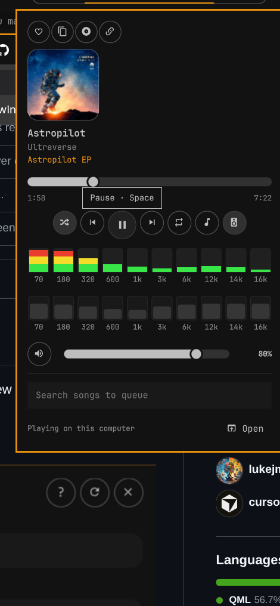
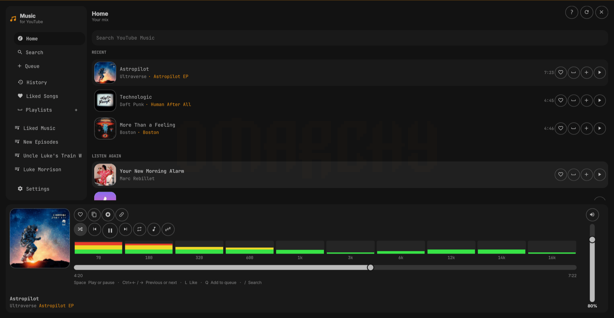
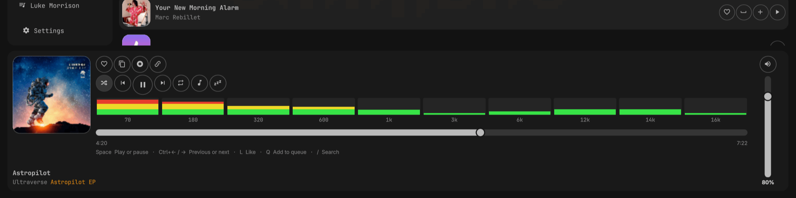

# YouTube Music player — how to use it

Index on the [repo homepage](https://github.com/lukejmorrison/omamusic).

Plugin id `wizwam.omamusic`. This is the **Omarchy bar + full window** player:
search, library, playlists, a mini player, and local **mpv** playback. It is
not a Chromium tab and not the official YouTube Music app.

The command-line / agent interface is a separate page:
[CLI.md](CLI.md).

## Install

```bash
omarchy plugin add https://github.com/lukejmorrison/omamusic.git --enable
```

Needs `mpv` and `yt-dlp`:

```bash
omarchy pkg add mpv yt-dlp
```

The first time you play something, the plugin installs a user venv and a
systemd user unit (`omarchy-ytmusic.service`) that is **never enabled at
login**. The player starts it when you need it.

## Sign in

Search and Home work as a guest. Library, likes, and playlists need the
YouTube Music session already in **daily Chromium** (not OpenClaw Chrome on
`127.0.0.1:9222`).

1. Sign in at [music.youtube.com](https://music.youtube.com) in Chromium.
2. Super+Shift+M, or click the bar chip.
3. **Set up and continue** → **Use Chromium session**.

Cookies land in `~/.config/omarchy-ytmusic/browser.json` (mode 600). Do not
paste that file into chat.

## Bar chip

The chip sits on the right of the bar, before the tray. It shows the current
artist and title, like the cliamp now-playing pill.


| Input | Action |
| --- | --- |
| Left-click | Mini player |
| Hover the chip | Previous / play / next |
| Middle-click | Previous track |
| Right-click | Next track |
| Super+Shift+M | Full player |

## Mini player

Open it from the bar chip. Cover on top, title under it, like/copy for the
song and album, then seek, transport, spectrum, EQ, and volume.



- **Space** play or pause
- **/** or **Ctrl+K** search; click a result to play it, queue button to play it next
- **E** cycles EQ presets (the speaker-style chicklet in the transport row)
- **Open** at the bottom-right is the full player

The ten green/yellow/red bars are live spectrum (what you hear, including EQ).
The row of sliders under them is the equalizer.

## Full player

Super+Shift+M toggles the window. Sidebar is Home, Search, Queue, History,
Liked Songs, playlists, and Settings.



Home shows **Your mix**. Click a row to play it, or use the heart / queue /
play chicklets on the right of each row.

### Footer

Like and copy sit above the transport for both the song and the album. The
spectrum is the same ten bands as the mini player. Seek matches that width.
Volume is the vertical slider on the right.



| Input | Action |
| --- | --- |
| Space | Play or pause |
| Ctrl+Left / Ctrl+Right | Previous / next |
| Shift+Left / Shift+Right | Seek 10 seconds |
| L | Like the playing song |
| Q | Add the selected song to the queue |
| Ctrl+S / Ctrl+R | Shuffle / repeat |
| Ctrl+Shift+H | History |
| Ctrl+Shift+L | Lyrics (Omasing, optional) |

## Search and library

Type in the search field at the top of the main pane (or `/` in the mini
player). Results are songs, albums, artists, and playlists. Click a song name
to play it, or an artist, album, or playlist name to open that page. Liked
Songs and your playlists need the Chromium session.

The first play after a fresh install can sit on **Preparing playback…** while
yt-dlp solves YouTube’s player challenge. Later plays are much faster.

## EQ and spectrum

Settings and the mini player share the same 10-band EQ (cliamp frequencies).
The last preset and custom bands are saved with plugin settings and restored
when playback reconnects.

Spectrum follows the sound leaving this computer (Pulse/PipeWire monitor), so
EQ moves energy between bands.

## Remove

```bash
~/.config/omarchy/plugins/wizwam.omamusic/scripts/remove-runtime.sh --purge
omarchy plugin remove wizwam.omamusic --yes
```

Then delete the Super+Shift+M override in `~/.config/hypr/bindings.lua` if you
want Spotify back on that key.

## More

- [CLI.md](CLI.md) — `omarchy-ytmusic` for terminals and agents
- [TECHNICAL.md](TECHNICAL.md) — socket protocol and backend
- [UPSTREAM.md](../UPSTREAM.md) — fork pin
